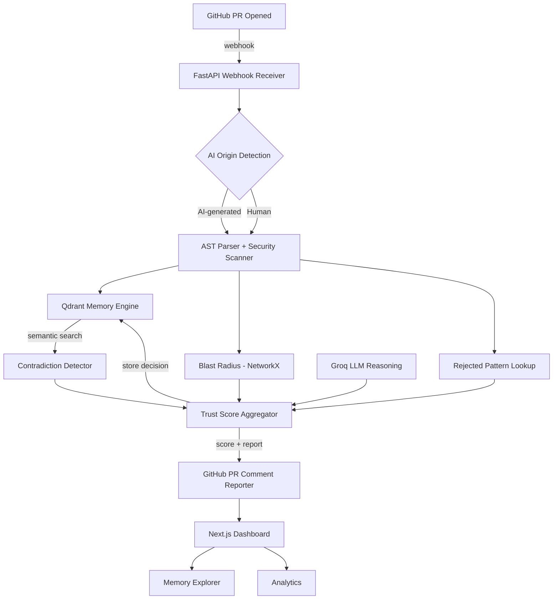
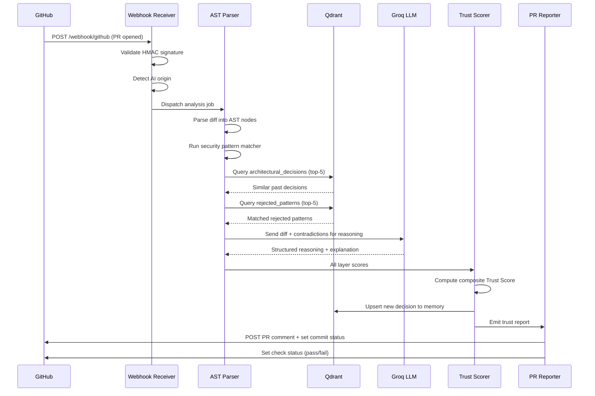
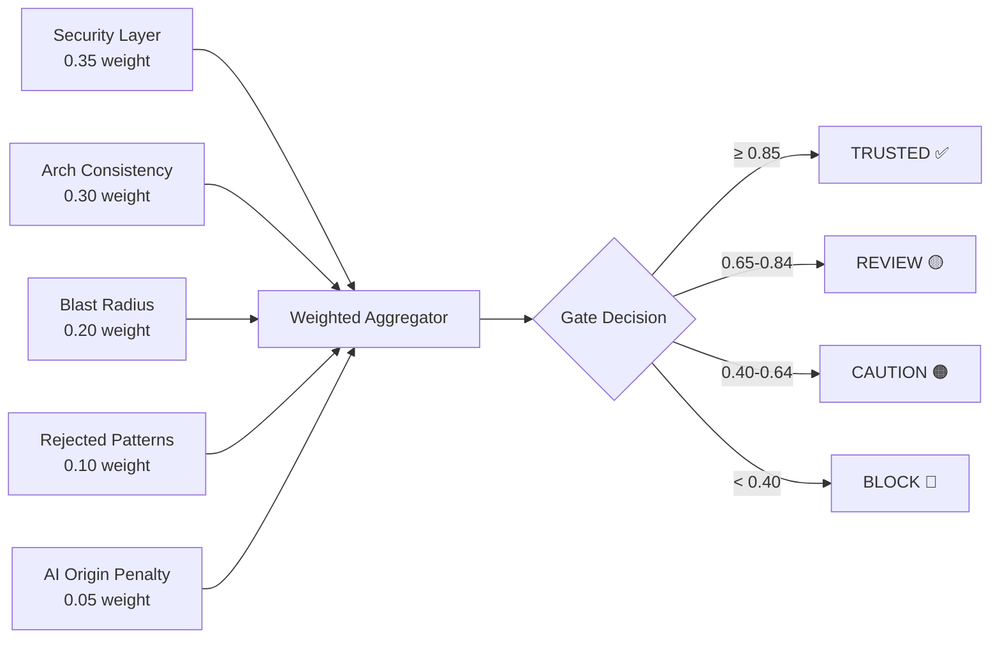

<!-- VAULTCI README -->

```
██╗   ██╗ █████╗ ██╗   ██╗██╗  ████████╗ ██████╗██╗
██║   ██║██╔══██╗██║   ██║██║  ╚══██╔══╝██╔════╝██║
██║   ██║███████║██║   ██║██║     ██║   ██║     ██║
╚██╗ ██╔╝██╔══██║██║   ██║██║     ██║   ██║     ██║
 ╚████╔╝ ██║  ██║╚██████╔╝███████╗██║   ╚██████╗██║
  ╚═══╝  ╚═╝  ╚═╝ ╚═════╝ ╚══════╝╚═╝    ╚═════╝╚═╝
```

[](LICENSE)
[](https://python.org)
[](https://fastapi.tiangolo.com)
[](https://nextjs.org)
[](https://qdrant.tech)
[](https://groq.com)
[](https://qdrant.tech/hackathon)

---

## 🔐 VaultCI — AI Trust Layer for Agentic Coding Pipelines

> **VaultCI verifies that AI-generated code is safe to ship — before it reaches production.**

---

## ❗ Problem Statement

- **AI agents write invisible risks:** Codex, Claude Code, and Devin open PRs autonomously — introducing security vulnerabilities, direct SQL queries, and rejected patterns that no reviewer catches because the code _looks_ clean.
- **No tool has architectural memory:** Existing code review tools (CodeRabbit, Snyk, Copilot Review) check syntax and known CVEs, but none know _why_ your team made past decisions or which patterns were explicitly rejected 6 weeks ago.
- **Blast radius is invisible:** An AI modifies a shared utility used by 40 services. Nobody flags it. 40 services break in production.

---

## ⚙️ How VaultCI Works

1. **Intercept** — GitHub webhook fires when any PR is opened. VaultCI detects whether it is AI-generated via commit metadata and statistical fingerprinting.
2. **Analyze** — Five verification layers run in parallel: AST security scan, architectural contradiction detection, rejected pattern lookup, blast radius calculation, and Groq LLM reasoning.
3. **Query Memory** — Qdrant vector collections are searched for semantically similar past decisions. If the new code contradicts an architectural rule, VaultCI surfaces the original PR and the engineer who made the call.
4. **Score** — A composite Trust Score (0.0–1.0) is calculated with per-layer weights. Gate decision: `TRUSTED / REVIEW / CAUTION / BLOCK`.
5. **Report** — A structured comment is posted to the PR with the score, gate, per-file risk map, contradiction references, and a Groq-generated human-readable explanation.

---

## 🏆 Trust Score

| Score | Gate | Action | Meaning |
|-------|------|--------|---------|
| **0.85 – 1.0** | `TRUSTED` | Auto-approve eligible | Safe, consistent, no contradictions |
| **0.65 – 0.84** | `REVIEW` | Human review required | Minor concerns, spot-check flagged areas |
| **0.40 – 0.64** | `CAUTION` | Detailed review required | Architectural concerns found |
| **0.00 – 0.39** | `BLOCK` | Merge blocked | Critical vulnerabilities or contradictions |

**Formula:**
```
TS = 0.35·Security + 0.30·ArchConsistency + 0.20·BlastRadius + 0.10·RejectedPatterns + 0.05·AIOriginPenalty
```

---

## 🏗️ Architecture



---

## 🔄 PR Analysis Sequence



---

## 🧮 Trust Score Calculation



---

## 🛠️ Tech Stack

| Layer | Technology | Role |
|-------|-----------|------|
| **Frontend** | Next.js 15 + TypeScript | SSR dashboard, real-time PR feed |
| **Styling** | Tailwind CSS + shadcn/ui + Framer Motion | Glassmorphism UI, animations |
| **Backend** | Python FastAPI | Webhook receiver, async orchestration |
| **LLM** | Groq (llama-3.3-70b-versatile) | Code intent reasoning, contradiction explanation |
| **AST** | tree-sitter (Python) | Language-agnostic security pattern matching |
| **Dep. Graph** | NetworkX | Blast radius, betweenness centrality |
| **Vector DB** | **Qdrant** | Architectural decision memory, semantic search |
| **Embeddings** | sentence-transformers/all-MiniLM-L6-v2 | Free, local, 384-dim embeddings |
| **Relational DB** | PostgreSQL 15 | Structured PR reports, rejected patterns |
| **GitHub** | REST API + Webhooks | PR ingestion, commit status, comments |
| **CVE** | OSV API (Google) | Open source vulnerability lookup, free |
| **Infra** | Docker Compose | One-command local setup |

---

## 🚀 Quick Start

```bash
# 1. Clone the repo
git clone https://github.com/Prakhar2025/vaultci.git
cd vaultci

# 2. Copy env file and fill in your keys
cp .env.example .env
# Edit: GITHUB_WEBHOOK_SECRET, GITHUB_TOKEN, GROQ_API_KEY

# 3. Start everything with one command
docker-compose up -d

# Services:
#   Frontend  → http://localhost:3000
#   Backend   → http://localhost:8000
#   Qdrant    → http://localhost:6333
#   Postgres  → localhost:5432

# 4. Initialize the database and Qdrant collections
docker-compose exec backend python scripts/init_db.py

# 5. Expose your webhook with ngrok (for GitHub integration)
ngrok http 8000
# Set GitHub webhook URL: https://<ngrok-url>/webhook/github
```

---

## 📡 API Endpoints

| Method | Endpoint | Description |
|--------|----------|-------------|
| `POST` | `/webhook/github` | Receive GitHub PR webhook events |
| `GET` | `/report/{owner}/{repo}/{pr}` | Fetch trust report for a PR |
| `POST` | `/memory/query` | Semantic search over architectural decisions |
| `POST` | `/memory/decision` | Manually add a decision to memory |
| `GET` | `/analytics/{owner}/{repo}` | Repository-level trust analytics |
| `GET` | `/health` | Health check |

---

## 🔴 Qdrant Integration

VaultCI uses Qdrant as its core memory engine — the primary differentiator over all existing PR review tools.

### Collections

| Collection | Vector Size | Distance | Purpose |
|-----------|-------------|----------|---------|
| `architectural_decisions` | 384 | Cosine | Stores every architectural decision extracted from past PRs. Queried on each new PR to detect contradictions. |
| `rejected_patterns` | 384 | Cosine | Stores code patterns explicitly rejected in past reviews. AI-generated PRs are checked against this. |
| `code_snippets` | 384 | Cosine | Stores function-level code snippets for semantic similarity comparison across PRs. |

### Why Qdrant

- **Semantic contradiction detection**: A direct SQL query can contradict a "use repository pattern" decision — keyword matching misses this. Qdrant's cosine similarity catches it.
- **Compounding memory**: Every PR adds new vectors. The longer a team uses VaultCI, the smarter its memory becomes.
- **Local Docker mode**: Qdrant runs fully locally — no API key, no cost, no latency.
- **Payload filtering**: Qdrant filter by `repo_id` ensures each repository's memory is isolated.

---

## 🏆 Hackathon Submission

This project was built for the **Qdrant "Think Outside the Bot" Virtual Hackathon** (deadline June 1, 2026).

Qdrant is the **core** of VaultCI — not a peripheral component. The entire architectural memory engine (contradiction detection, rejected pattern lookup, decision storage) is powered by Qdrant vector collections. Without Qdrant, VaultCI does not exist.

**Built by:** Prakhar Shukla | [github.com/Prakhar2025](https://github.com/Prakhar2025) | prakhar230125@gmail.com

---

## 📄 License

MIT — See [LICENSE](LICENSE)
